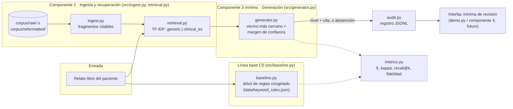

# TDSE · Copiloto de Triage RAG

Prototipo funcional de los **componentes 2 y 3 (versión mínima)** de un copiloto de
apoyo al triage de urgencias basado en generación aumentada por recuperación (RAG):
ingesta y recuperación sobre normativa colombiana de triage, más un clasificador
mínimo que produce una sugerencia de nivel **con cita obligatoria o abstención**.

El sistema **asiste, no decide**: produce una sugerencia trazable a un fragmento
normativo concreto, o se abstiene cuando la evidencia recuperada es insuficiente o
contradictoria. La clasificación final es siempre responsabilidad del personal de
salud.

Este repositorio implementa, en forma de software ejecutable, el diseño
experimental descrito en el documento del proyecto: ingesta de corpus en dos
formatos (crudo y reformateado), recuperación con dos modos de vectorización
(genérico y adaptado al dominio clínico en español), un clasificador mínimo con
citación obligatoria, una línea base de reglas, un registro de auditoría, y las
métricas formales (tasa de sub-triage ponderada, kappa ponderado, recall@k,
fidelidad de citación) necesarias para evaluar las cuatro celdas del diseño 2x2
más la línea base.

## Arquitectura

El prototipo sigue una arquitectura de **pipeline en capas**, con una separación
estricta entre recuperación (evidencia) y generación (sugerencia), y un registro
de auditoría transversal a ambas. No hay una capa de servicio/API: la evaluación
de este semestre es un pipeline offline por lotes, no un servicio desplegado (ver
"Limitaciones" más abajo).



**Flujo de datos (`src/pipeline.py` orquesta los tres primeros pasos):**

1. **Ingesta (`ingest.py`)** parsea `corpus/raw/` o `corpus/reformatted/` en
   `Chunk`s, cada uno con un id de cita y, cuando aplica, un único nivel de
   triage asociado. El formato crudo usa expresiones regulares frágiles a
   propósito (simula un extractor genérico de PDF/tabla); el reformateado usa
   encabezados `[CITA: ...]` limpios. Esta es la manifestación concreta de la
   brecha G3 del documento del proyecto (guías con *layout* complejo).
2. **Recuperación (`retrieval.py`)** indexa esos fragmentos con TF-IDF propio
   (sin dependencias externas) y expone `retrieve(texto, k)`. El modo
   `clinical_es` aplica un léxico de normalización coloquial→clínico antes de
   vectorizar, como sustituto determinista de un modelo de embeddings de
   dominio (Factor B del diseño 2x2).
3. **Generación (`generator.py`)** toma los fragmentos recuperados y aplica una
   regla de vecino-más-cercano con margen de confianza: sugiere el nivel del
   fragmento más similar, o se abstiene si la evidencia es insuficiente o
   contradictoria. Nunca emite un nivel sin una cita que lo respalde.
4. **Auditoría (`audit.py`)** registra, para cada caso, el relato de entrada,
   los fragmentos recuperados con su score, la versión de corpus/embeddings, y
   la sugerencia (incluida la abstención), en JSON Lines — la base para que un
   humano pueda revisar y para que `metrics.py` pueda evaluar.
5. La **línea base C0 (`baseline.py`)** es una ruta independiente y paralela:
   un árbol de reglas por palabras clave (`data/keyword_rules.json`, congelado
   antes de evaluar) que recibe el mismo relato de texto libre, sin pasar por
   recuperación ni por el componente 3.
6. **`experiments/run_experiment.py`** ejecuta las cuatro celdas del diseño 2x2
   (E1-E4) más C0 sobre `data/cases.json` y calcula las métricas formales de
   `metrics.py` (Sección "Métricas" abajo).

Esta arquitectura corresponde a una versión mínima y ejecutable de la "vista
arquitectónica preliminar" del documento del proyecto (componentes 1-4:
extracción del relato, recuperación, generación con citación, y revisión
humana): aquí los componentes 2 y 3 están implementados en versión mínima:
`demo.py` funciona como una interfaz de inspección manual muy básica del
componente 4 (revisión humana), no como la interfaz de producción descrita
conceptualmente en el documento. La integración con historia clínica (FHIR),
la multi-tenencia y el despliegue como servicio quedan fuera de esta
arquitectura de prototipo (ver "Limitaciones").

### ¿Por qué esta arquitectura?

Cada decisión de diseño responde a una restricción concreta del proyecto (un
prototipo académico, de un semestre, sin acceso garantizado a internet ni a
servicios pagos, evaluado offline) y no a preferencia arbitraria:

- **Recuperación separada de generación (RAG explícito, no un LLM "a secas”).**
  El documento del proyecto exige que toda sugerencia sea trazable a una
  fuente normativa citable y que el sistema se abstenga si no hay evidencia
  suficiente (principio "evidencia y trazabilidad"). Eso solo es verificable
  si la recuperación es una etapa independiente e inspeccionable, no un paso
  oculto dentro de un modelo de lenguaje. Por eso `retrieval.py` y
  `generator.py` son módulos separados con una interfaz explícita
  (`RankedChunk` con `chunk_id` y `score`).
- **TF-IDF propio como backend por defecto, embeddings reales como opción.**
  El diseño experimental 2x2 (Sección "Diseño experimental") exige una
  evaluación offline 100% reproducible sin credenciales externas, así que el
  backend *por defecto* no puede depender de una API. TF-IDF con la
  biblioteca estándar cumple esa condición. Para quien quiera más precisión
  semántica a cambio de depender de una API externa, `GeminiRetriever` (ver
  "Backend LLM opcional") ofrece embeddings reales detrás de la misma
  interfaz `retrieve(texto, k)` — es una opción explícita, no el camino por
  defecto, precisamente para no comprometer la reproducibilidad del
  experimento académico.
- **Vecino-más-cercano con margen como backend por defecto, LLM real como
  opción, para el componente 3.** Un LLM real introduce una dependencia de
  red/API (rompe la reproducibilidad offline por defecto) y, sin controles,
  podría "alucinar" una cita. La regla determinista es más simple pero **su
  comportamiento es 100% explicable**: la cita siempre corresponde
  exactamente al fragmento que ganó la decisión. `LLMBackedGenerator` (ver
  "Backend LLM opcional") ofrece la alternativa con un LLM real, pero
  reutiliza el mismo principio de seguridad: el modelo solo puede elegir una
  cita de la lista de fragmentos que el `Retriever` ya recuperó, nunca
  inventar un nivel directamente.
- **Línea base de reglas totalmente separada del copiloto.** Si la línea base
  reutilizara el mismo `Retriever`, cualquier mejora en recuperación
  contaminaría también a la línea base, y H1/H2 dejarían de medir lo que
  el documento del proyecto pide medir (RAG vs. reglas). Por eso
  `baseline.py` no importa nada de `retrieval.py` ni `generator.py`.
- **Auditoría como módulo transversal, no como responsabilidad del
  generador.** Si `generator.py` escribiera directamente al registro, cambiar
  el formato de auditoría obligaría a tocar la lógica de decisión. Separar
  `audit.py` permite versionar el esquema de trazabilidad de forma
  independiente, como pide la Sección 4.3 del documento del proyecto.
- **Sin capa de servicio/API.** El documento del proyecto acota
  explícitamente el semestre a una evaluación offline por lotes (Tabla de
  alcance): el despliegue como servicio, la multi-tenencia y la
  interoperabilidad FHIR se declaran fuera de alcance. Añadir un servidor web
  habría sido trabajo no evaluable dentro del diseño experimental 2x2 y una
  dependencia externa (framework web) que el proyecto evita a propósito.

## Aviso importante

- El texto de `corpus/` es una **reconstrucción sintética**, elaborada por el
  equipo con fines académicos, de la estructura general de cinco niveles de
  triage y de señales de alarma usada en el sistema colombiano y en escalas
  internacionales comparables. **No es una transcripción literal ni oficial**
  de la Resolución 5596 de 2015 ni de ninguna guía clínica institucional.
- El conjunto de 74 viñetas de `data/cases.json` es sintético y fue etiquetado
  por el propio equipo (sin evaluadores clínicos externos), con doble ciego
  intra-equipo y niveles I-II sobremuestreados (18 y 15 casos respectivamente,
  ambos por encima del mínimo de 15 exigido en el documento del proyecto,
  Sección 5). Ya cumple el **rango de 60-100 casos** que pide el protocolo
  original — lo que sigue faltando, y es la brecha real, es que el doble
  ciego lo hizo el propio equipo y no evaluadores clínicos externos: sirve
  para ejercitar el pipeline y la maquinaria de métricas de extremo a
  extremo, **no** para sostener una afirmación de seguridad clínica real.
- Este software es un prototipo académico. **No debe usarse para tomar
  decisiones clínicas reales.**

## Instalación

Requiere Python 3.10+. No tiene dependencias externas (todo el pipeline usa la
biblioteca estándar), precisamente para que la evaluación offline sea
reproducible sin acceso a internet ni a paquetes de terceros.

```bash
git clone <url-del-repositorio>
cd TDSE_Copiloto_de_Triage_RAG
python -m unittest discover -s tests -v   # correr las pruebas
python -m experiments.run_experiment      # correr el diseño 2x2 + linea base
python -m experiments.analyze_external_data  # analizar el dataset real (ver abajo)
python demo.py "el paciente tiene dolor en el pecho y sudoracion fria"
python gui.py                              # interfaz grafica (ver "Interfaz grafica")
```

## Interfaz gráfica

`gui.py` es una interfaz de escritorio (Tkinter, incluido en la instalación
estándar de Python; no agrega dependencias) con tres pestañas, cada una
envolviendo un punto de entrada ya existente del prototipo — no duplica
lógica, solo la expone visualmente:

1. **Consulta individual**: caja de texto para el relato del paciente,
   selector de corpus (`raw`/`reformatted`) y de embeddings
   (`generic`/`clinical_es`), y un botón que muestra la sugerencia del
   copiloto (nivel + cita, o abstención con su razón), los fragmentos
   recuperados con su score, y la sugerencia de la línea base C0 para
   comparar. Es el equivalente gráfico de `demo.py`.
2. **Experimento 2x2**: un botón que corre las celdas E1-E4 más C0 sobre
   `data/cases.json` y muestra la misma tabla de resultados que
   `python -m experiments.run_experiment`.
3. **Dataset real**: un botón que analiza
   `data/external_triage_urgencias_colombia.csv` y muestra el mismo resumen
   que `python -m experiments.analyze_external_data` (distribución de
   niveles, tiempos de atención, y la prueba chi-cuadrado por red de IPS).

Cada botón corre el cómputo en un hilo en segundo plano para no congelar la
ventana; los resultados se entregan de vuelta al hilo principal de Tkinter
con `widget.after(...)`, que es la forma segura de actualizar la interfaz
desde un hilo secundario.

```bash
python gui.py
```

## Backend LLM opcional (Gemini)

Además del backend determinista (TF-IDF + vecino-más-cercano, por defecto, sin
red), el prototipo soporta un segundo backend que usa **embeddings y
generación reales de la API de Gemini**, para mayor robustez semántica ante
relatos con vocabulario o redacción muy variada. Es estrictamente opcional:
todo el resto del proyecto (incluida toda la evaluación de
`run_experiment.py`) sigue funcionando sin él.

### Cómo configurar tu propia API key (nunca la compartas ni la commitees)

1. Consigue tu propia key en <https://aistudio.google.com/apikey>.
2. Configúrala como variable de entorno **en tu sesión de terminal**, nunca
   escrita en un archivo del repositorio:

   ```powershell
   # PowerShell (Windows)
   $env:GEMINI_API_KEY = "tu-key-aqui"
   ```

   ```bash
   # bash / zsh (Linux, macOS, Git Bash)
   export GEMINI_API_KEY="tu-key-aqui"
   ```

3. Usa `--backend gemini` en `demo.py`, selecciona "gemini" en el
   desplegable de `gui.py`, o pasa `backend="gemini"` a `CopilotoPipeline`.

**Por qué nunca debe ir en el README ni en el código:** una key commiteada
queda en el historial de git para siempre, incluso si luego se "borra" en un
commit posterior — cualquiera con acceso al repositorio (o a una copia vieja)
puede usarla a tu costa. Si alguna vez compartes una key por accidente (por
chat, captura de pantalla, etc.), **revócala de inmediato** en Google AI
Studio y genera una nueva. `.gitignore` ya excluye `.env` y el archivo de
caché de embeddings por esta misma razón; `.env.example` documenta el nombre
de la variable sin ningún valor real.

### Qué cambia exactamente con este backend

- **Recuperación:** `GeminiRetriever` (`src/retrieval.py`) reemplaza el
  TF-IDF por el modelo `gemini-embedding-001`, usando la codificación
  **asimétrica** de la API: el corpus se embebe con
  `task_type="RETRIEVAL_DOCUMENT"` y el relato del paciente con
  `task_type="RETRIEVAL_QUERY"` (para el mismo texto, ambos vectores tienen
  una similitud coseno de solo ~0.84, es decir, son realmente distintos).
  Usar el `task_type` correcto en cada lado, en vez del comportamiento por
  defecto de la API, es lo que más mejoró la calidad de la recuperación en la
  comparación de abajo. Los embeddings del corpus se cachean en
  `data/.gemini_embedding_cache.json` (excluido de git) para no volver a
  pagar esa llamada en cada ejecución.
- **Generación:** `LLMBackedGenerator` (`src/llm_generator.py`) reemplaza la
  regla de vecino-más-cercano por una llamada a `gemini-flash-lite-latest`
  con salida JSON forzada a un esquema fijo (`citation`, `abstain`,
  `reasoning`).
- **Seguridad, sin excepciones:** el modelo **solo puede elegir una cita de
  la lista de fragmentos que el propio `Retriever` recuperó** — nunca se le
  pide ni se le permite inventar un nivel directamente, y el nivel final
  siempre se deriva de nuestra propia tabla `LEVEL_BY_CITATION`, nunca de un
  campo de texto libre del modelo. Si el modelo devuelve una cita que no está
  en la lista de candidatos, el sistema se abstiene (`tests/test_llm_generator.py`
  prueba explícitamente este caso). Este es el mismo principio de "evidencia
  y trazabilidad" del documento del proyecto, aplicado también al backend LLM.
- **Robustez ante fallos de red:** si `GEMINI_API_KEY` no está configurada, o
  la API falla incluso después de reintentos, `CopilotoPipeline` cae
  automáticamente al backend determinista **para ese caso**, sin interrumpir
  la ejecución; queda registrado en el registro de auditoría
  (`"backend": "gemini_fallback_deterministic"`).

### Comparación real: determinista vs. Gemini

`experiments/compare_backends.py` corre ambos backends sobre las mismas 74
viñetas de `data/cases.json` (resultado real en `results/backend_comparison.md`):

```bash
python -m experiments.compare_backends
```

| Métrica | Determinista | Gemini |
|---|---|---|
| Cobertura (no abstención) | 0.48 | 0.91 |
| S (sub-triage ponderado) | 0.125 | 0.000 |
| Sensibilidad I-II | 0.303 | 0.879 |
| Recall@k | 0.606 | 0.909 |
| Tasa de abstención indebida | 0.515 | 0.091 |

Con 74 casos esto sigue siendo ilustrativo, no una conclusión estadística — pero
la dirección del resultado es consistente con lo esperado: los embeddings
reales de Gemini (con codificación asimétrica consulta/documento) generalizan
mucho mejor que TF-IDF ante frases que no comparten vocabulario literal con
el corpus, y la comprensión de lenguaje natural del LLM resuelve mejor los
casos ambiguos que la regla de vecino-más-cercano (incluyendo abstenerse
correctamente en relatos genuinamente insuficientes, como los casos
C031-C034). El costo es depender de una API externa: latencia de red, un
costo por llamada, y la necesidad de manejar la key con cuidado.

## Estructura del repositorio

```
corpus/
  raw/            Guías en formato crudo (tablas y flujogramas sin reformatear)
  reformatted/    Las mismas guías, reformateadas a texto estructurado con citas
                  (31 fragmentos: 5 niveles + 13 motivos de consulta x 2 ramas)
data/
  cases.json      74 viñetas sintéticas con gold standard intra-equipo
  keyword_rules.json  Línea base de reglas (C0), congelada antes de evaluar
  external_triage_urgencias_colombia.csv  Dataset real de Datos Abiertos Colombia (ver abajo)
src/
  ingest.py        Parseo de ambos formatos de corpus a fragmentos citables
  retrieval.py     Recuperación TF-IDF ('generic'/'clinical_es') + GeminiRetriever opcional
  generator.py     Componente 3 mínimo: nivel + cita, o abstención (determinista)
  llm_client.py    Cliente minimo de la API de Gemini (sin SDK, solo urllib)
  llm_generator.py Componente 3, backend Gemini: nivel + cita validada, o abstención
  baseline.py      Línea base C0 (árbol de reglas, sin RAG)
  metrics.py       S (sub-triage), kappa ponderado, recall@k, abstención
  stats.py         Utilidades estadísticas genéricas (chi-cuadrado, tablas de contingencia)
  audit.py         Registro de auditoría (JSON Lines)
  pipeline.py      Orquesta un caso: recuperación -> generación -> auditoría (ambos backends)
experiments/
  run_experiment.py        Ejecuta las celdas E1-E4 + C0 sobre data/cases.json
  analyze_external_data.py Analiza el dataset real (distribución de niveles y tiempos)
  compare_backends.py      Compara backend determinista vs. Gemini sobre data/cases.json
results/
  summary.md                  Resultados en Markdown (generado por run_experiment.py)
  raw_results.json            Resultados en JSON (generado por run_experiment.py)
  audit_*.jsonl                Registro de auditoría por celda (generado por run_experiment.py)
  external_data_summary.md    Análisis del dataset real (generado por analyze_external_data.py)
  backend_comparison.md/json  Comparación real determinista vs. Gemini (generado por compare_backends.py)
tests/            Pruebas unitarias de cada módulo (incluye GUI y llamadas a Gemini simuladas)
demo.py           CLI de una sola consulta, para inspección manual (soporta --backend)
gui.py            Interfaz gráfica de escritorio (Tkinter), ver "Interfaz gráfica"
.env.example      Plantilla para configurar GEMINI_API_KEY (nunca poner la key real aquí)
```

## Fuentes de datos reales

Se buscaron activamente bases de datos reales que pudieran mejorar el
prototipo. El hallazgo central: **no existen historias clínicas reales de
triage con relato libre del paciente y de acceso abierto sin restricciones**
(por buenas razones de protección de datos de salud); lo que sí existe, y se
documenta aquí con honestidad sobre qué puede y qué no puede hacer cada
fuente:

### Integrado en este repositorio

- **[Clasificación en Triage Urgencias](https://www.datos.gov.co/Salud-y-Protecci-n-Social/Clasificaci-n-en-Triage-Urgencias/vt5n-eu2r)**
  (Datos Abiertos Colombia, dataset `vt5n-eu2r`, ~89.000 registros, acceso
  público sin credenciales vía API Socrata). Es un dataset **administrativo**:
  trae nivel de triage (I-V) y marcas de tiempo de ingreso/atención de una red
  de IPS, **no** el relato del paciente. Se descargó completo a
  `data/external_triage_urgencias_colombia.csv` y se analiza con
  `experiments/analyze_external_data.py` (resultado real en
  `results/external_data_summary.md`). Sirve para dos cosas que el documento
  del proyecto dejó como supuestos no verificados:
  - Confirma empíricamente que los niveles I-II son una fracción muy pequeña
    de los casos reales (~3.3% en este dataset), lo que justifica con datos —
    no solo con intuición — la decisión de sobremuestrearlos en
    `data/cases.json`.
  - Da una referencia real (aunque secundaria e ilustrativa) de tiempos de
    ingreso a atención por nivel, en lugar de las cifras puramente
    hipotéticas que el documento del proyecto declaraba explícitamente como
    no medidas.
  - Adicionalmente, una prueba de independencia chi-cuadrado (nivel de
    triage x red de IPS, implementada en `src/stats.py` sin dependencias
    externas) encuentra una diferencia estadísticamente significativa entre
    redes (χ² ≈ 2162, df = 12, p ≈ 0): por ejemplo, RED OCCIDENTE clasifica
    solo 3.1% de sus casos como Nivel IV, frente a 12.3% en RED NORTE. Esto
    sugiere heterogeneidad real en el criterio de clasificación entre redes,
    relevante para cualquier calibración futura del prototipo por región.

### Relevantes para una fase posterior (no integradas)

- **[MIMIC-IV-ED Demo](https://physionet.org/content/mimic-iv-ed-demo/2.2/)**
  (PhysioNet, 100 pacientes, acceso abierto sin credenciales): sí incluye
  motivo de consulta en texto libre, nivel ESI (1-5) y signos vitales — la
  estructura más parecida a lo que necesita el clasificador de texto del
  copiloto — pero está en **inglés** y de un hospital de EE. UU., por lo que
  no es sustituto de datos en español sin una traducción/adaptación cuidadosa
  (y sería una forma razonable de probar si la arquitectura generaliza a otro
  idioma). El dataset completo (~425.000 estancias) existe en PhysioNet pero
  requiere registro, entrenamiento en sujetos humanos y firma de un acuerdo de
  uso de datos (DUA).
- **[ClinText-SP](https://arxiv.org/pdf/2503.18594)** y
  **CoWeSe (Corpus Web Salud Español)**: corpus abiertos de texto clínico y
  biomédico en español (26M y ~750M tokens respectivamente), no específicos de
  triage. Son la ruta natural para entrenar un modelo real de embeddings
  clínicos en español y así reemplazar el léxico de normalización de
  `retrieval.py` (modo `clinical_es`) por un modelo real, cerrando la brecha
  G1 del documento del proyecto.
- **[CARMEN-I](https://www.ncbi.nlm.nih.gov/pmc/articles/PMC12215073/)**:
  2.000 documentos clínicos anonimizados del Hospital Clínic de Barcelona en
  español/catalán (informes de alta, interconsultas, radiología). Útil para
  NER/anonimización, no para triage específicamente.

Ninguna de estas fuentes internacionales sustituye la necesidad, señalada en
el documento del proyecto, de una validación clínica externa con
profesionales de salud colombianos sobre el dominio y la normativa
específicos de este prototipo.

## Diseño experimental (resumen)

Se compara la línea base de reglas (**C0**) contra cuatro celdas de un diseño
factorial 2x2 sobre el copiloto:

| Celda | Corpus | Embeddings |
|---|---|---|
| E1 | crudo | genérico |
| E2 | reformateado | genérico |
| E3 | crudo | clínico en español |
| E4 | reformateado | clínico en español |

- **Factor A (formato del corpus):** crudo (tablas y flujogramas sin modificar,
  con ids de cita opacos) vs. reformateado (fragmentos estructurados con cita
  semántica explícita).
- **Factor B (embeddings):** este entorno no tiene garantizado acceso a
  internet ni a pesos preentrenados, así que **no se descarga un modelo real de
  embeddings**. En su lugar, ambos modos usan el mismo motor TF-IDF; el modo
  `clinical_es` añade, antes de vectorizar, un léxico de normalización que
  traduce expresiones coloquiales del relato ("me falta el aire") a su término
  clínico equivalente ("dificultad respiratoria"), como sustituto determinista
  y reproducible de un modelo de embeddings clínico en español (p. ej. Carrino
  et al., 2022). Sustituir esta pieza por un modelo real de embeddings es la
  ruta natural de evolución de este prototipo y no cambia el resto del
  pipeline ni la interfaz de `Retriever`.

El clasificador mínimo (componente 3) es una regla de vecino-más-cercano sobre
los fragmentos recuperados: sugiere el nivel del fragmento más similar si su
similitud supera un umbral mínimo y aventaja con un margen suficiente al mejor
fragmento que proponga un nivel distinto; en caso contrario, se abstiene.

## Métricas

- **S (tasa de sub-triage ponderada):** promedio de `max(0, nivel_sugerido -
  nivel_referencia)` sobre los casos con sugerencia no abstenida. Solo
  penaliza cuando el sistema subestima la urgencia.
- **Sensibilidad I-II:** de los casos cuyo nivel de referencia es I o II, qué
  fracción fue sugerida también como I o II (una abstención cuenta como fallo,
  por diseño conservador).
- **Recall@k:** fracción de casos en los que el fragmento normativo correcto
  apareció entre los k fragmentos recuperados (k=5).
- **Fidelidad de citación:** de las sugerencias no abstenidas, qué fracción
  cita efectivamente el criterio correcto.
- **Kappa ponderado cuadrático (κ_w):** acuerdo intra-equipo en el
  etiquetado del gold standard (no es una validación clínica externa).

Las fórmulas completas están documentadas como docstrings en `src/metrics.py`.

## Resultados

`results/summary.md` y `results/raw_results.json` contienen la salida real de
`python -m experiments.run_experiment` sobre las 74 viñetas de este
repositorio. Un extracto representativo (los números exactos pueden variar
levemente si se edita `data/cases.json` o los umbrales de `src/generator.py`):

- Con 74 casos (ya dentro del rango de 60-100 del protocolo original), las
  diferencias entre celdas son más estables que con el conjunto reducido de
  34, pero siguen sin ser una conclusión estadística formal (no se reporta
  un test de hipótesis entre celdas); el valor de este resultado es mostrar
  que el pipeline y las métricas funcionan de extremo a extremo sobre un
  conjunto de tamaño realista, no declarar cuál celda "gana" de forma
  definitiva.
- El sistema determinista se sigue absteniendo en una fracción considerable
  de los casos elegibles: es consecuencia de un umbral de margen conservador
  sobre un corpus de 31 fragmentos (ampliado desde los 17 iniciales — ver
  "Fuentes de datos reales" y el historial de commits), no un error del
  pipeline. El backend Gemini opcional (ver "Backend LLM opcional") reduce
  esa abstención de forma sustancial sobre el mismo conjunto de 74 casos,
  a cambio de depender de una API externa.

## Limitaciones (heredadas del documento del proyecto)

- El gold standard es intra-equipo, no una validación clínica externa. El
  κ_w reportado mide consistencia interna del criterio aplicado, no
  corrección clínica.
- El corpus normativo es una reconstrucción sintética reducida, no el texto
  oficial completo de la Resolución 5596 ni de guías clínicas institucionales.
- El backend **por defecto** de "embeddings clínicos en español" es un proxy
  determinista (TF-IDF + léxico de dominio), no un modelo de embeddings real;
  existe un backend opcional con embeddings y LLM reales de Gemini (ver
  "Backend LLM opcional"), pero depende de una API externa, tiene costo por
  llamada, y su evaluación (`compare_backends.py`) es tan ilustrativa como la
  del diseño 2x2 (74 casos, no concluyente estadísticamente).
- La evaluación central (`run_experiment.py`, diseño 2x2) es 100% offline y
  por lotes; no mide latencia bajo concurrencia ni incluye un despliegue en
  producción. El backend Gemini sí depende de red, pero sigue evaluándose
  por lotes, no como servicio desplegado.
- El dataset externo real (`data/external_triage_urgencias_colombia.csv`) es
  administrativo y de una sola red de IPS reportante: no contiene relato de
  paciente, no es necesariamente representativo de todo el país, y no se usa
  para entrenar ni evaluar el clasificador de texto (ver "Fuentes de datos
  reales").

## Extensión a un despliegue real

**Ya implementado** (ver "Backend LLM opcional"): el reemplazo de TF-IDF por
embeddings reales (`GeminiRetriever`) y de la regla determinista por un LLM
real (`LLMBackedGenerator`), ambos detrás de un backend opcional que no
rompe el camino determinista por defecto. Puntos de extensión que quedan
pendientes:

- Entrenar/usar un modelo de embeddings clínicos en español fijo y propio
  (p. ej. sobre ClinText-SP o CoWeSe, ver "Fuentes de datos reales") en vez
  de depender de la API de un proveedor externo — reduciría costo y
  dependencia de red, a cambio de mantenimiento propio del modelo.
- `data/cases.json` ya tiene 74 casos (dentro del rango de 60-100 del
  protocolo original), pero el doble ciego lo hizo el propio equipo. Repetir
  el etiquetado con evaluadores clínicos externos reales, siguiendo el
  esquema ya definido en cada registro (`evaluator1`, `evaluator2`,
  `resolution_method`, etc.), sigue siendo la brecha más importante para
  pasar de "prototipo funcional" a "evidencia de seguridad clínica real"
  (ver "Limitaciones").
- Validar la generalización de la arquitectura con MIMIC-IV-ED (en inglés)
  antes de intentar una validación clínica formal en español.
- Si se despliega el backend Gemini en producción: mover la API key a un
  gestor de secretos (no una variable de entorno de shell) y agregar límites
  de tasa/costo por IPS o por usuario.

## Licencia

MIT. Ver `LICENSE`.
